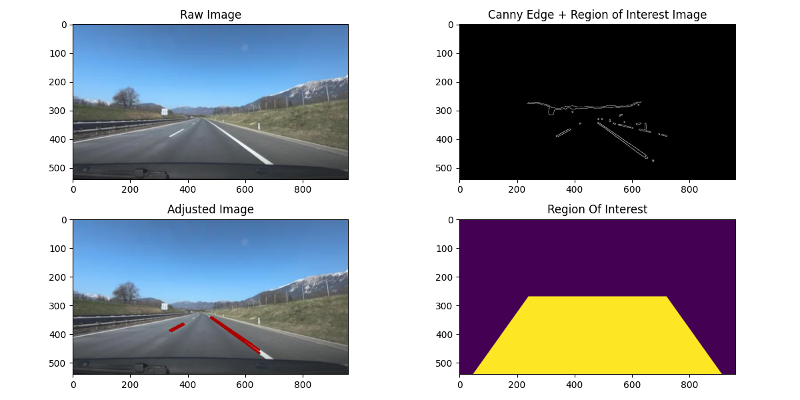

# Lane Detection - Hough Line Transform
This was my first attempt at building a lane detection model, using the **Probabilistic Hough Line Transform**, alongside **HLS color thresholding**, **Gaussian blur**, **Canny edge detection**, and a **defined region-of-interest mask**. I found the results to be satisfying, especially given how new this concept was to me. It required many hours of reading through OpenCV-Python's and MoviePy's extensive documentation and calibrating detection thresholds, but it helped me develop a deeper understanding of how computers interpret images and video. I know that this would produce better results once layered with other methods of lane detection. Nonetheless, this was a great learning opportunity, and I look forward to researching autonomous driving vehicles further.


## Features
- Detects lane lines in both **images (.png; .jpg)** and **videos (.mp4)**
- Uses **dynamic color thresholding** to adapt to different lightness/saturation environments
- Region-of-interest masking removes irrelevant noise outside the road
- Uses **HoughLinesP** to estimate lane segments and then **line()** to draw them onto the frame
- Allows user to select files through a simple Tkinter GUI
- Creates a processed video (-Result.mp4) with visualized lane lines, or displays the images after processing using **Matplotlib.pyplot**


## Examples
| Input Image | Result |
|------------|---------|
|  |  |

| Input Video | Result |
|------------|---------|
|  |  |


## Project Pipeline
Below is the path the program takes through the functions to process the image or video. As well as clarification on nearly every line of code.


### (1) `select_file()`
<details>
      <summary>Click to view code snippet select_file()</summary>
  
  ```python
  def select_file():
    # Opens a tkinter file dialog for the user to select an image/video, then process it accordingly
    root = tk.Tk()
    root.withdraw()

    # Opens files on computer to allow user to easily select image or video to process
    file_path = filedialog.askopenfilename(
        title="Select an Image or Video File",
        filetypes=[("Media Files", "*.png;*.jpg;*.mp4")]
    )

    root.destroy() # Remove file dialog once done

    if not file_path: # If no file path was selected exit program
        print("No file selected. Program exited!")
        sys.exit(0)

    extension = file_path.lower().split(".")[-1] # Determines the extension of the file given

    if extension in ['png', 'jpg']: # If the given file is an image then continue
        img = cv.imread(file_path) # Grabs image from files with given file path NOTE: OpenCV automatically converts this image to BGR from this function

        if img is None: # If OpenCV can't find or read image exits program
            print("Couldn't open selected image. Program will exit.")
            sys.exit(0)
        
        plot_image(img) # Once openCV has read the image file- start processing the image
    
    elif extension in ['mp4']: # If the given file is a video then continue
        clip = VideoFileClip(file_path) # Grabs video from files with given file path NOTE: Unline the photo, for this I used MoviePy, so it will be in RGB until I convert it

        if clip is None: # If MoviePy can't find or read video exits program
            print("Couldn't open selected video. Program will exit.")
            sys.exit(0)

        # This goes thru and process each individual frame of the given video and then saves it to the folder the original video was found on the device
        processed_clip = clip.image_transform(process_frame)
        output_path = file_path.rsplit(".", 1)[0] + "-Result.mp4"
        processed_clip.write_videofile(output_path, audio=False)

        return
    
    else: # If given a file that's not a video or image, then exit the program
        print("Unsupported file type.")
        sys.exit(0)
  ```
</details>


### (2) `plot_image()` or `process_frame()`
<details>
      <summary>Click to view code snippet plot_image()</summary>
  
  ```python
def plot_image(img):
    # Process an individual image given: resize, color-threshold, Gaussian blur, Canny edge, apply ROI, Hough transform, and draw lane lines
    # Then display the raw image, masked canny image, adjusted image, and the ROI

    # Resizes the any image inputted to be the same size
    height, width = img.shape[:2]
    scale = TARGET_WIDTH / width
    img = cv.resize(img, (TARGET_WIDTH, int(height * scale)))

    raw_image = img.copy() # Copy of original image
    image_to_edit = img.copy() # Copy of original image

    masked_canny_image, adjusted_image, roi = color_threshold(image_to_edit, raw_image) # Calls on the functions mentioned below, and returns the processed images needed

    # Creates the plot objects, with 2 rows and 2 columns, and a figure size of 12x6
    _, axes = plt.subplots(2, 2, figsize=(12,6))

    # Sets up the plot for the raw image
    axes[0,0].imshow(cv.cvtColor(img, cv.COLOR_BGR2RGB))
    axes[0,0].set_title('Raw Image')

    # Sets up the plot that has the HLS color thresholding, Gaussian blur, Canny Edge, and ROI mask layered on top
    axes[0,1].imshow(masked_canny_image, cmap='gray')
    axes[0,1].set_title("Canny Edge + Region of Interest Image")

    # Sets up the plot for the adjusted image, essentially the raw image but layered with the detected lines on top
    axes[1,0].imshow(cv.cvtColor(adjusted_image, cv.COLOR_BGR2RGB))
    axes[1,0].set_title("Adjusted Image")

    # Shows the geometry of the ROI mask  
    axes[1,1].imshow(roi)
    axes[1,1].set_title("Region Of Interest")

    # Displays the plots set up above
    plt.tight_layout()
    plt.show()
```
</details>

<details>
      <summary>Click to view code snippet process_frame()</summary>

  ```python
def process_frame(frame):
    # This function is used whenever the program is given a video, processes each individual frame of the video and returns the adjusted frame
    # Resize given frame to a set ratio, where given (height, width) becomes (height * (960 / width), 960)
    height, width = frame.shape[:2]
    scale = TARGET_WIDTH / width
    frame = cv.resize(frame, (TARGET_WIDTH, int(height * scale)))

    frame_bgr = cv.cvtColor(frame, cv.COLOR_RGB2BGR) # Converts frame from RGB-BGR as openCV operates on images in BGR
    raw_image = frame_bgr.copy() # Copy of original frame
    image_to_edit = frame_bgr.copy() # Copy of original frame

    _, adjustedImage, _ = color_threshold_image(image_to_edit, raw_image) # Passes on the frame to process and detect lines

    return cv.cvtColor(adjustedImage, cv.COLOR_BGR2RGB) # Converts it back from BGR to RGB before returning the frame layered with the detected lines
```
</details>


### (3) `color_threshold()`
<details>
      <summary>Click to view code snippet color_threshold()</summary>
  
  ```python
def color_threshold(image_to_edit, raw_image):
    # Apply HLS color thresholding to isolate the white and yellow lane markings that fall into the selected range of HLS
    hls_image = cv.cvtColor(image_to_edit, cv.COLOR_BGR2HLS) # Converts image/frame from BGR to HLS
    _, L, S = cv.split(hls_image) # Splits the image thats now in HLS into three individual channels H, L, S; instead of being combined

    height = L.shape[0] # Could pull the height from the _, L, S- they all would give the same result

    road_lightness = L[int(height*0.5):, :] # Defines the area we will find the magnitude of lightness from as bottom half of photo (the road)
    road_saturation = S[int(height*0.5):, :] # Defines the area we will find the magnitude of lightness from as bottom half of photo (the road)

    l_thresh = np.percentile(road_lightness, 94) # Creates the threshold for lightness as the top 94% of pixels in the bottom half of photo
    l_thresh = int(np.clip(l_thresh, 0, 255)) # This makes the new range (255*0.94 to 255) instead of the default (0 to 255)

    s_thresh = np.percentile(road_saturation, 80) # Creates the threshold for saturation as the top 80% of pixels in the bottom half of photo
    s_thresh = int(np.clip(s_thresh, 0, 255)) # This makes the new range (255*0.8 to 255) instead of the default (0 to 255)

    # Creates the white mask which will only allow for pixels that are in the range of white to be pulled from the image/frame
    white_mask = cv.inRange(
        hls_image,
        np.array([0, l_thresh, s_thresh], dtype=np.uint8),
        np.array([180, 255, 140], dtype=np.uint8)
    )

    # Creates the yellow mask which will only allow for pixels that are in the range of yellow to be pulled from the image/frame
    yellow_mask = cv.inRange(
        hls_image,
        np.array([18, max(80, l_thresh-30), 110], dtype=np.uint8),
        np.array([35, 255, 255], dtype=np.uint8)
    )

    kernel = cv.getStructuringElement(cv.MORPH_RECT, (5, 5)) # This is going to be used to color in small gaps where we find a bunch of pixels of either yellow or white
    white_mask = cv.morphologyEx(white_mask, cv.MORPH_CLOSE, kernel) # Colors in small gaps where a bunch of pixels in the specified range of white are found
    yellow_mask = cv.morphologyEx(yellow_mask, cv.MORPH_CLOSE, kernel) # Colors in small gaps where a bunch of pixels in the specified range of yellow are found

    combined_mask = cv.bitwise_or(white_mask, yellow_mask) # Combines the masks- Now have one image/frame which only carries pixels in the specified range of yellow or white

    return gaussian_blur_and_canny(combined_mask, raw_image)
```
</details>


### (4) `gaussian_blur_and_canny()`
<details>
      <summary>Click to view code snippet gaussian_blur_and_canny()</summary>
  
  ```python
def gaussian_blur_and_canny(combined_mask, raw_image):
    # Apply Gaussian blur and Canny edge to the image/frame
    blurred_image = cv.GaussianBlur(combined_mask, (9,9), 0)
    canny_edges = cv.Canny(blurred_image, 120, 200)

    return region_of_interest(canny_edges, raw_image)
```
</details>

  
### (5) `color_threshold()`
<details>
      <summary>Click to view code snippet color_threshold()</summary>
  
  ```python
def region_of_interest(canny_edges, raw_image):
    # Creates the region of interest that has a shape of a polygon and apply to canny edges- so that only edges inside ROI are kept
    mask = np.zeros_like(canny_edges) # Creates an array of 0s with same shape and data type as canny_edges image/frame to draw the polygon on (the selected region of interest)

    height, width = canny_edges.shape[:2] # Grabs height and width from canny_edges image/frame

    # Defines the vertices of ROI
    roi_vertices = np.array([[
        (width*0.05, height),
        (width*0.25, height*0.5),
        (width*0.75, height*0.5),
        (width*0.95, height)]], 
        dtype=np.int32)

    cv.fillPoly(mask, roi_vertices, 255) # Fills in the ROI
    masked_canny_image = cv.bitwise_and(canny_edges, mask) # Combines canny_edges with the ROI mask- Gives an image/frame with only the edges detected within the ROI

    return hough_line_transform(masked_canny_image, raw_image, mask)
```
</details>


### (6) `hough_line_transform()`
<details>
      <summary>Click to view code snippet hough_line_transform()</summary>
  
  ```python
def hough_line_transform(masked_canny_image, raw_image, roi_mask):
    # Utilizes Probalistic Hough Line Transform to detect the line segments along the image/frame and draw them ontop of the original image/frame
    height = raw_image.shape[0]

    # Maps all the edge points from given image/frame, with a corresponding rho and theta value measured from the origin. Then esentially tallies a number of votes of edge pixels in a line, and if there is enough votes then creates the line segment
    lines = cv.HoughLinesP(
        masked_canny_image, 
        rho = 1.5, # Distance resolution in pixels of the Hough grid 
        theta = np.pi/180, # Angular resolution in radians of the Hough grid
        threshold = 50, # Minimum number of votes (intersections in Hough grid)
        lines = np.array([]), # Array that holds the positions of lines detected
        minLineLength = (height*0.02), # Minimum number of pixels making up a line
        maxLineGap = (height*0.02)  # Maximum gap in pixels between connectable line segments
    )

    # Loops through the lines that were detected
    if lines is not None: 
        for line in lines: # Reality check to ensure the array (lines) is created and has elements before attempting to cycle through it
            x1, y1, x2, y2 = line.reshape(4) # Unpacks line coordinates found in Hough Line Transform

            if abs(x2-x1) > 0: # Reality Check to ensure that the program is never dividing (y2-y1) by 0
                m = (y2-y1)/(x2-x1) # The slope of the line segment

                if  abs(m) > 0.4: # Eliminates any line segment that is nearly horizontal
                    cv.line(raw_image, (x1, y1), (x2, y2), (0, 0, 170), 5) # Draws the line detected in a crimson color, and a thickness of 6 pixels
    
    return masked_canny_image, raw_image, roi_mask
```
</details>
